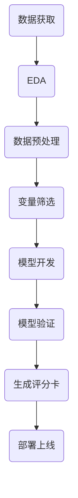

# 金融评分卡模型
应用逻辑回归模型实现标准金融评分卡

# 开发流程

## 数据预处理 -- 变量分箱
#### 无监督分箱
1. 等频分箱：把自变量按从小到大的顺序排列，根据自变量的个数等分为k部分，每部分作为一个分箱。
2. 等距分箱：把自变量按从小到大的顺序排列，将自变量的取值范围分为k个等距的区间，每个区间作为一个分箱。
3. 聚类分箱：用k-means聚类法将自变量聚为k类，但在聚类过程中需要保证分箱的有序性。

#### 有监督分箱
1. Best-KS
2. 卡方分箱

### Best-KS
1. 将特征值值进行从小到大的排序。
2. 计算出KS最大的那个值，即为切点，记为D。然后把数据切分成两部分。
3. 重复步骤2，进行递归，D左右的数据进一步切割。直到KS的箱体数达到我们的预设阈值即可。

**Best-KS分箱特点**
1. 连续型变量：分箱后的KS值<=分箱前的KS值
2. 分箱过程中，决定分箱后的KS值是某一个切点，而不是多个切点的共同作用。这个切点的位置是原始KS值最大的位置。

### 卡方分箱
卡方分箱是自底向上的(即基于合并的)数据离散化方法。它依赖于卡方检验:具有最小卡方值的相邻区间合并在一起,直到满足确定的停止准则。

**基本思想**:对于精确的离散化，相对类频率在一个区间内应当完全一致。如果两个相邻的区间具有非常类似的类分布，则这两个区间可以合并；否则，它们应当保持分开。而低卡方值表明它们具有相似的类分布。

